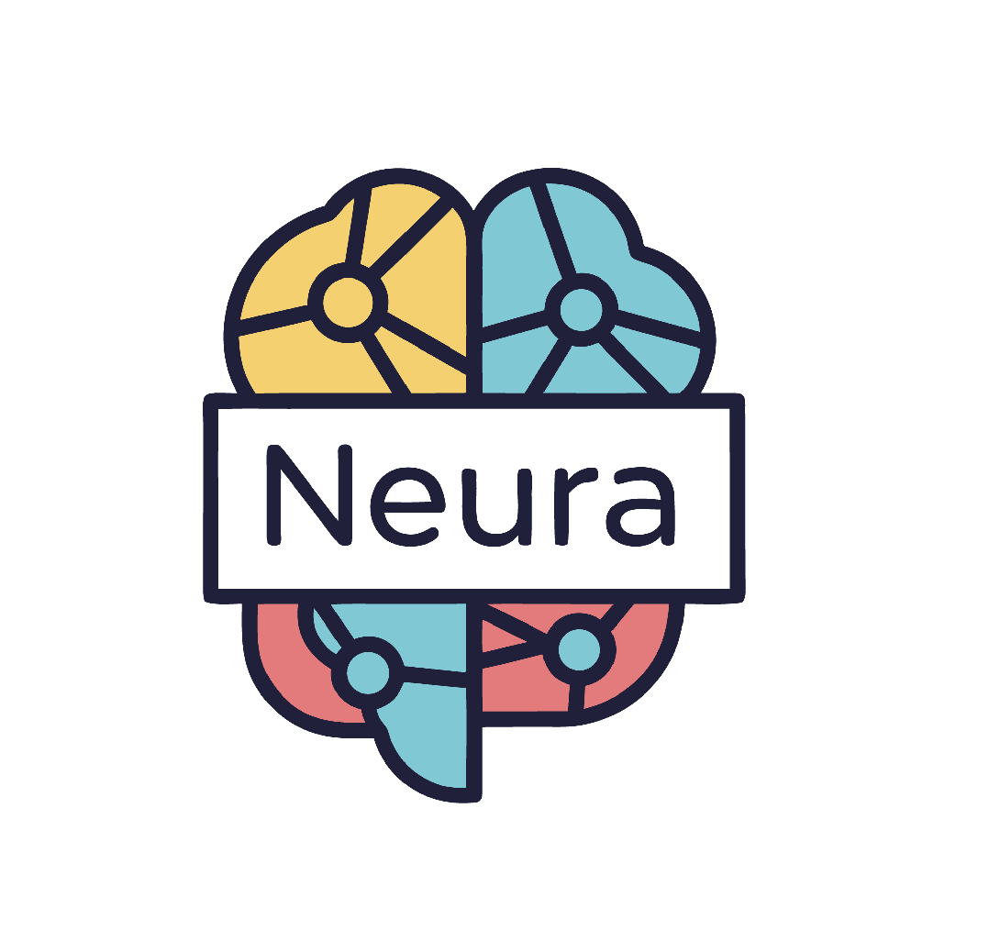
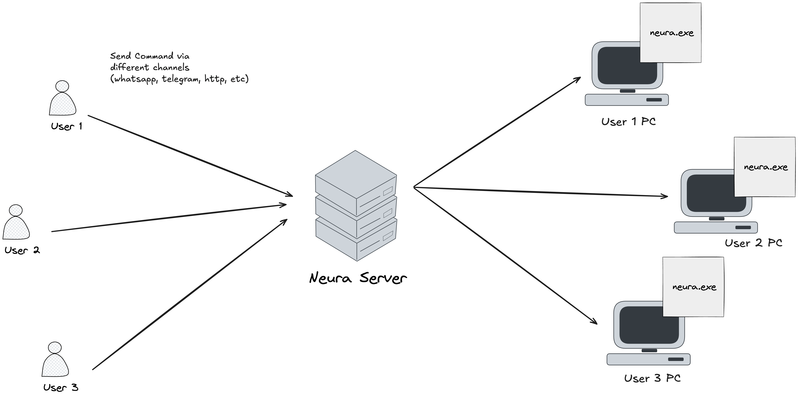

# Neura

<!-- Logo placeholder - add 128x128px logo here -->



[](https://www.typescriptlang.org/)
[](https://opensource.org/licenses/MIT)
[]()

> A secure AI-powered local automation runtime controlled through messaging
> platforms.

---

## What is Neura?

Neura is a local system automation runtime that transforms natural language
commands from messaging platforms into secure, validated system operations. It
runs on your machine, receives commands via messaging interfaces, and executes
them through a security-first intent classification engine.

**Execution Flow:**

```
Messaging Platform → Neura Runtime → Intent Classification → Security Layer → Execution Engine
```

**Example:**

```
WhatsApp: "Deploy the production build"
    ↓
Neura: [Classifies: system_command] [Security: sensitive] [Confirmation required]
    ↓
User: "Confirm"
    ↓
Neura: [Executes deployment script] [Returns status]
```

---

## Architecture



Neura operates as a distributed command system with a central server and local
runtime agents:

1. **Command Ingestion** - Neura Server receives commands from messaging
   platforms (WhatsApp, Telegram, HTTP API)
2. **Intent Classification** - AI-driven analysis categorizes commands into
   structured intents
3. **Dispatch & Validation** - Commands are routed to target user PCs with
   security classification and confirmation policies applied
4. **Local Execution** - Neura runtime on the user's machine performs validated
   system operations with full audit logging

---

## Core Capabilities

| Capability                 | Description                                                            |
| -------------------------- | ---------------------------------------------------------------------- |
| **Intent Classification**  | AI-driven analysis of natural language into structured system intents  |
| **Security Validation**    | Risk-based classification with confirmation level enforcement          |
| **Controlled Automation**  | System operations executed within defined security boundaries          |
| **AI-Assisted Validation** | Command interpretation with reasoning and confidence scoring           |
| **Local Runtime**          | All processing occurs on the user's machine; no cloud execution        |
| **Audit Logging**          | Comprehensive logging of all commands, classifications, and executions |

---

## Security Model

Neura implements a defense-in-depth security architecture:

### Confirmation Levels

| Level             | Behavior                             | Applicable Operations                              |
| ----------------- | ------------------------------------ | -------------------------------------------------- |
| **None**          | Immediate execution                  | Read-only operations, information retrieval        |
| **Simple**        | Single confirmation                  | Standard system commands, package management       |
| **Explicit**      | Detailed confirmation with reasoning | Destructive operations, process management         |
| **Authenticated** | Multi-factor verification            | Security-critical operations, privilege escalation |

### Operation Classifications

- **SAFE** - Read operations, low risk
- **SENSITIVE** - State-modifying operations requiring confirmation
- **RESTRICTED** - Security-sensitive operations blocked by policy
- **OUT OF SCOPE** - Non-automation queries rejected

### Security Boundaries

Neura explicitly blocks:

- Credential access (SSH keys, passwords, tokens)
- Permission escalation attempts
- Suspicious network operations
- Security feature disablement
- Cryptocurrency mining
- General knowledge queries (out of scope)

---

## Intended Use Cases

- **Remote System Administration** - Manage servers via messaging platforms
- **Development Operations** - Deploy builds, manage environments remotely
- **Infrastructure Automation** - Execute maintenance tasks with mobile
  confirmation
- **Secure Command Relay** - Controlled system access without direct shell
  exposure

---

## Non-Goals

Neura is explicitly **not**:

- A chatbot or conversational interface
- A general knowledge Q&A system
- A cloud-based execution service
- A general-purpose LLM interface
- An uncontrolled automation system

---

## Table of Contents

- [Quick Start](#quick-start)
- [Example Usage](#example-usage)
- [Documentation](#documentation)
- [Roadmap](#roadmap)
- [License](#license)

---

## Quick Start

### Prerequisites

- Node.js 18+
- pnpm 10+
- OpenAI API key

### Installation

```bash
# Clone the repository
git clone https://github.com/peekaboo5149/neura.git
cd neura

# Install dependencies
pnpm install

# Configure environment
cp .env.example .env
# Edit .env and add your OPENAI_API_KEY
```

### Start the Runtime

```bash
# Development mode
pnpm dev

# Production build
pnpm build && pnpm start
```

The runtime exposes an API on `http://localhost:3000` by default.

---

## Example Usage

### Send a Command

```bash
curl -X POST http://localhost:3000/api/query \
  -H "Content-Type: application/json" \
  -d '{"query": "Check disk usage"}'
```

**Response:**

```json
{
  "message": "Command reveived will start execution",
  "sessionId": "xxxx-xxxx-xxxx-xxxx"
}
```

### Classification Examples

| Input                            | Intent             | Security     | Action               |
| -------------------------------- | ------------------ | ------------ | -------------------- |
| "Show running processes"         | system_command     | safe         | Auto-execute         |
| "Install Docker"                 | package_management | sensitive    | Confirm then execute |
| "Delete log files"               | file_write         | sensitive    | Confirm with details |
| "Show SSH private key"           | ssh_key_access     | restricted   | Blocked              |
| "What is the capital of France?" | unknown            | out of scope | Rejected             |

---

## Documentation

- [Overview](./docs/overview.md) — Philosophy, vision, and design principles
- [Capabilities](./docs/capabilities.md) — Intent taxonomy and execution model
- [Architecture](./docs/architecture.md) — System design and component structure
- [Security Model](./docs/security-model.md) — Security classifications and
  threat model
- [Intent Classification](./docs/intent-classification.md) — Classification
  system and schema
- [Development Guide](./docs/development-guide.md) — Setup, testing, and
  contribution
- [Roadmap](./docs/roadmap.md) — Future direction and planned features

---

## Roadmap

### Current (MVP)

- [x] Intent classification engine
- [x] Security classification with confirmation levels
- [x] REST API for command ingestion
- [x] Audit logging framework

### Near Term

- [ ] Messaging platform integrations (WhatsApp, Telegram)
- [ ] Daemon mode for background operation
- [ ] Command execution engine
- [ ] WebSocket support for real-time status

### Future

- [ ] Multi-agent orchestration
- [ ] Persistent audit trails
- [ ] Metrics and observability
- [ ] Enterprise authentication

---

## License

MIT License — see [LICENSE](./LICENSE) for details.

---

**Note:** Neura is under active development. APIs and features are subject to
change.
